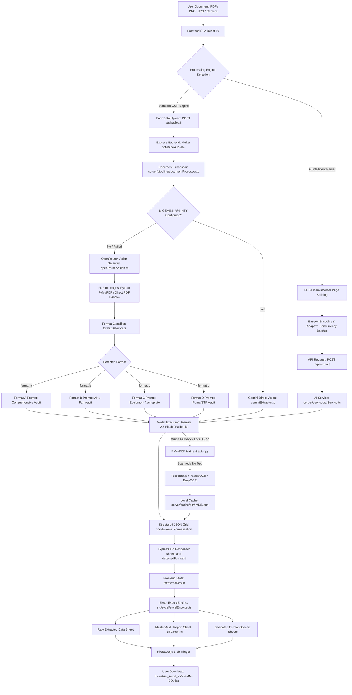
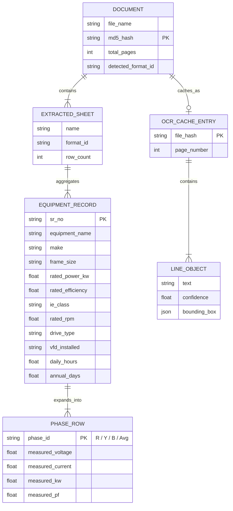
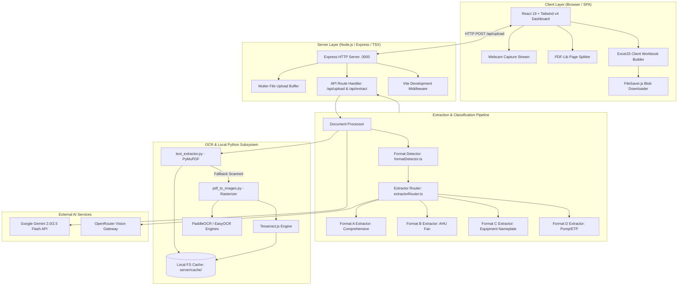

# Technical Documentation: DocuStruct AI (Industrial Document Digitizer)

---

## 1. Technologies Used

DocuStruct AI is an enterprise-grade industrial document digitization platform. It processes technical PDFs, scanned equipment logs, nameplates, and single-line/multi-line electrical audit tables into structured, standardized Microsoft Excel (`.xlsx`) workbooks.

| Technology | Version | Usage |
|---|---|---|
| **TypeScript** | `~5.8.2` | Primary language for frontend SPA and backend Express services, providing strict type-safety across extraction schemas. |
| **JavaScript (ES Modules)** | `ES2022 / Node.js >=20.0.0` | Runtime environment for server modules, build tooling, and client bundling. |
| **Python** | `3.10+` | Underpins document OCR runners, PyMuPDF rasterization/text extraction, layout segmentation, and computer vision preprocessing. |
| **React** | `^19.0.0` | Frontend single-page application framework for reactive UI state management, camera captures, live progress streaming, and table editing. |
| **Vite** | `^6.2.0` | Next-generation frontend build tool, asset bundler, and development server with Hot Module Replacement (HMR) middleware integration. |
| **Tailwind CSS** | `^4.1.14` | Utility-first styling framework configured via `@tailwindcss/vite` and `autoprefixer` for responsive layout rendering. |
| **Express.js** | `^4.22.2` | Backend HTTP API server orchestrating file uploads, AI vision routing, fallback pipelines, and static file delivery. |
| **Multer** | `^2.1.1` | Multipart/form-data middleware handling direct PDF and image uploads with a 50MB payload limit. |
| **ExcelJS** | `^4.4.0` | Comprehensive server and client-side spreadsheet engine used to generate multi-tab, styled, and formula-ready Excel workbooks. |
| **SheetJS (xlsx)** | `^0.18.5` | Auxiliary tabular data parser and utility for quick JSON-to-sheet conversions. |
| **PDF-Lib** | `^1.17.1` | In-browser PDF manipulation library used to split multi-page documents into individual base64 page streams. |
| **pdf-parse** | `^2.4.5` | Node.js utility for text extraction from text-based PDF files. |
| **Tesseract.js** | `^7.0.0` | Pure JavaScript OCR fallback engine used when native Python extraction is unavailable or for scanned documents. |
| **PyMuPDF (fitz)** | `1.24.9` | High-performance Python library for fast PDF-to-image rasterization and native character/bounding box extraction. |
| **OpenCV (opencv-python)** | `4.6.0.66` | Computer vision library for image preprocessing (grayscale, adaptive thresholding, morphological line filtering, CLAHE contrast enhancement). |
| **PaddleOCR** | `2.7.3` | Deep learning-based OCR framework used in local Python workers for angled text detection and character recognition. |
| **EasyOCR** | `1.7.x` | Fallback deep-learning OCR engine utilizing PyTorch for character boundary detection. |
| **Google Gemini API** | `gemini-2.5-flash`, `gemini-2.0-flash`, `gemini-2.0-flash-lite-001` | Vision LLMs applied for zero-shot format classification, OCR post-correction, and structured JSON table extraction. |
| **OpenRouter API** | `v1/chat/completions` | Multi-model routing gateway providing resilient access to Gemini vision models with failover mechanisms. |
| **Lucide React** | `^0.546.0` | Iconography library providing icons across the UI dashboard and file handling views. |
| **Motion (Framer Motion)** | `^12.23.24` | Animation library powering smooth transitions, progress bars, and modal overlays. |
| **FileSaver.js** | `^2.0.5` | Client-side blob download trigger for saving generated `.xlsx` spreadsheets to user storage. |
| **Axios** | `^1.16.1` | Promise-based HTTP client for dispatching vision prompts and payload batches to external AI endpoints. |
| **Zod** | `^4.4.3` | Schema validation library ensuring runtime payload integrity. |
| **Dotenv** | `^17.2.3` | Environment configuration manager reading `.env` variables in Node.js processes. |
| **tsx** | `^4.21.0` | TypeScript Execute engine enabling live execution and file watching of TypeScript server scripts. |
| **Docker & Docker Compose** | `3.8 / Multi-Stage` | Containerization tool packaging the Node.js runtime, Python virtual environment, Poppler utilities, and dependencies. |
| **Nixpacks / Railway** | `Nixpacks` | Cloud deployment builder configured via `railway.json` for persistent backend service hosting. |
| **Vercel** | `v5.8.2` | Frontend hosting and edge routing platform configured via `vercel.json` for reverse proxy API rewrites. |

---

## 2. Project Data Flow

The project processes arbitrary technical documents (PDFs, scans, camera captures) and transforms them into structured Excel files conforming to industrial engineering schemas.



### Detailed Execution Steps:

1. **Origin of Data**: The user supplies documents via the web UI through drag-and-drop, native file browser selection, or direct live camera capture. Supported formats include PDF, PNG, JPG, JPEG, and DOCX (up to 50MB per file).
2. **Frontend Ingestion & Validation**:
   - `src/App.tsx` verifies file MIME types and size constraints.
   - For multi-page PDF documents processed via the Intelligent Parser path, `pdf-lib` splits the document client-side into individual single-page PDF binary buffers and converts them into Base64 strings.
3. **API Request Dispatch**:
   - **Upload Path**: The file is packaged as `multipart/form-data` and sent to `POST /api/upload`.
   - **Direct Extraction Path**: The base64-encoded image/PDF stream is sent inside a JSON payload to `POST /api/extract`.
4. **Backend Ingestion**:
   - `server/index.ts` intercepts requests using `multer` (storing files temporarily under `uploads/`) and applies JSON payload limits of up to 50MB.
5. **Format Classification**:
   - `server/detectors/formatDetector.ts` executes a lightweight vision call using `google/gemini-2.0-flash-lite-001` with `temperature: 0.0`.
   - The detector inspects table headers to classify the document into one of four domain formats:
     - `format-a`: Comprehensive Motor/Equipment Audit (Pumps, Compressors, Chillers, Annual Energy Cost).
     - `format-b`: AHU Fan Audit (Design Flow in CFM, Static Pressure in MMWG, Belt/Direct drive).
     - `format-c`: Equipment Nameplate / Motor Audit (Frame Size, Pulley Diameters, VFD configurations).
     - `format-d`: Pump / ETP Audit (Flow in $m^3/hr$, Head in $m$, Suction/Discharge pressure, Throttling).
6. **Isolated Format Extraction**:
   - `server/extractors/extractorRouter.ts` routes the payload to the corresponding isolated extractor (`formatAExtractor.ts`, `formatBExtractor.ts`, `formatCExtractor.ts`, or `formatDExtractor.ts`).
   - The primary vision model (`google/gemini-2.5-flash`) extracts tables into a strict JSON grid `string[][]`. If rate limits or timeouts occur, it falls back to `google/gemini-2.0-flash-001`.
   - Mechanical specifications (Make, Frame, Rated Power) are captured on the primary phase row (`Phase R`), and electrical measurements are expanded across a 4-row structure (`Phase R`, `Phase Y`, `Phase B`, and `Average`).
7. **Local OCR & Caching Subsystem**:
   - When external AI vision calls are bypassed or local OCR is invoked (`server/services/ocrService.ts`), the backend invokes `text_extractor.py` via Python child process.
   - If the document is scanned (no native text layer), it converts PDF pages to images via `pdf_to_images.py` and runs `Tesseract.js`, `paddleocrEngine.py`, or `easyocrEngine.py`.
   - Raw OCR and layout analysis results are cached to disk under `server/cache/ocr/<MD5_HASH>.json` and `server/cache/layout/<MD5_HASH>.json`.
8. **Normalization & Schema Alignment**:
   - `gridToRows()` and `gridToSheets()` in `server/pipeline/documentProcessor.ts` parse header rows and convert tabular data into standard JSON row objects (`Record<string, string>[]`).
9. **API Response Generation**:
   - The backend responds with HTTP 200 containing:
     ```json
     {
       "detectedFormatId": "format-a",
       "sheets": [
         {
           "name": "Comprehensive_Audit",
           "formatId": "format-a",
           "rows": [ { "Sr. No.": "1", "Equipment Name": "Main Pump", ... } ]
         }
       ]
     }
     ```
10. **Frontend State & Excel Export**:
    - `src/App.tsx` stores the result in `extractedResult` state and displays extracted tables.
    - When the user clicks **Download Excel**, `src/excel/excelExporter.ts` builds a workbook with:
      1. **Raw Extracted Data Sheet**: Direct tabular capture of all extracted columns.
      2. **Master Audit Report Sheet**: 28-column unified master schema with mapped headers, styled pink header bars (`#E91E8C`), frozen header rows, and highlighted Average phase rows (`#F1F5F9`).
      3. **Per-Format Sheets**: Dedicated tabs for each detected format with domain-specific metrics.
    - `file-saver` streams the blob to the user's browser with the filename `Industrial_Audit_YYYY-MM-DD.xlsx`.

---

## 3. Database

### Database Architecture & State Storage Strategy

DocuStruct AI employs a **stateless, document-processing pipeline architecture** combined with a **local filesystem caching and temporary staging tier**. It does not maintain a persistent relational (SQL) or document (NoSQL) database engine.

- **Primary Data Store**: In-Memory State during HTTP session processing and client UI state.
- **Cache Storage**: Local JSON file cache stored in `server/cache/ocr/` and `server/cache/layout/`.
- **Cache Keying**: Cryptographic MD5 hash of file binary contents (`crypto.createHash("md5").update(buffer).digest("hex")`).
- **Temporary Upload Buffer**: Multipart disk storage in `uploads/` directory with automatic cleanup on completion.

### Data Schemas & Field Definitions

#### 1. In-Memory Master Schema (28 Standardized Columns)

Used in the generated Excel `Master Audit Report` tab to unify disparate document formats into a single reporting schema.

| Table/Collection | Field | Data Type | Key | Description |
|---|---|---|---|---|
| `MasterAuditRow` | `Sr. No.` | `String / Number` | Key | Sequential equipment item number. |
| `MasterAuditRow` | `Audit Type` | `String` | - | Domain classification category (Motor, AHU, Pump, etc.). |
| `MasterAuditRow` | `Equipment/Pump Name` | `String` | - | Equipment identifier or tag name. |
| `MasterAuditRow` | `Application` | `String` | - | Operational application or plant location area. |
| `MasterAuditRow` | `Make` | `String` | - | Manufacturer / brand name (ABB, Siemens, KSB, etc.). |
| `MasterAuditRow` | `Frame Size` | `String` | - | Motor/equipment mechanical frame standard (e.g., 160M, 132S). |
| `MasterAuditRow` | `Mounting Type` | `String` | - | Mounting configuration (Foot or Flange mounted). |
| `MasterAuditRow` | `Rated Power (kW)` | `Number / String` | - | Nameplate power rating in kilowatts. |
| `MasterAuditRow` | `Rated Efficiency (%)` | `Number / String` | - | Nameplate nominal efficiency percentage. |
| `MasterAuditRow` | `IE Class` | `String` | - | Energy efficiency classification (IE1, IE2, IE3, IE4). |
| `MasterAuditRow` | `Rated RPM` | `Number / String` | - | Nominal rated revolutions per minute. |
| `MasterAuditRow` | `Connection Type` | `String` | - | Mechanical drive coupling (Direct Mount, Pulley, Gear, Belt). |
| `MasterAuditRow` | `VFD Installed` | `String` | - | Variable Frequency Drive installation status (Y/N). |
| `MasterAuditRow` | `VFD Frequency/Details` | `String` | - | Operating frequency (Hz), VFD make, and model information. |
| `MasterAuditRow` | `Daily Hours` | `Number / String` | - | Daily operating hours (hrs/day). |
| `MasterAuditRow` | `Annual Days` | `Number / String` | - | Annual operating days (days/year). |
| `MasterAuditRow` | `Design Flow` | `Number / String` | - | Rated design fluid/air flow rate ($m^3/hr$ or CFM). |
| `MasterAuditRow` | `Measured Flow` | `Number / String` | - | Actual measured flow rate during facility audit. |
| `MasterAuditRow` | `Design Head (m)` | `Number / String` | - | Design pump total dynamic head in meters. |
| `MasterAuditRow` | `Suction Pressure` | `Number / String` | - | Pump inlet suction pressure ($kg/cm^2$). |
| `MasterAuditRow` | `Discharge Pressure` | `Number / String` | - | Pump outlet discharge pressure ($kg/cm^2$). |
| `MasterAuditRow` | `Static Pressure` | `Number / String` | - | Air duct static pressure ($mm\text{ }wg$ or MMWG). |
| `MasterAuditRow` | `Observations/Drive Details` | `String` | - | Maintenance notes, throttling presence, pulley diameters. |
| `MasterAuditRow` | `Phase (R/Y/B/Avg)` | `String` | Key (Phase) | Electrical phase measurement indicator: `Phase R`, `Phase Y`, `Phase B`, or `Average`. |
| `MasterAuditRow` | `Measured Voltage (V)` | `Number / String` | - | Measured electrical potential across phases (Volts). |
| `MasterAuditRow` | `Measured Current (A)` | `Number / String` | - | Measured electrical current draw per phase (Amperes). |
| `MasterAuditRow` | `Measured Power (kW)` | `Number / String` | - | Active measured electrical load (kW). |
| `MasterAuditRow` | `Measured PF` | `Number / String` | - | Measured electrical power factor ($\cos \phi$, 0.00 to 1.00). |

---

#### 2. Local Filesystem Cache Schema (`server/cache/ocr/*.json`)

| Table/Collection | Field | Data Type | Key | Description |
|---|---|---|---|---|
| `OCR_Cache_Entry` | `page` | `Number` | Primary Key | 1-indexed document page number. |
| `OCR_Cache_Entry` | `lines` | `Array<LineObject>` | - | Array of detected text bounding boxes and confidence scores. |
| `LineObject` | `text` | `String` | - | Extracted text content. |
| `LineObject` | `confidence` | `Number` | - | Detection confidence score (0.0 to 1.0). |
| `LineObject` | `box` | `Array<[x, y]>` | - | Four coordinate polygon bounding box `[[x1,y1], [x2,y2], [x3,y3], [x4,y4]]`. |

---

### Entity Relationship Diagram



### Data Flow: Application $\leftrightarrow$ Storage / Cache

- **Application $\rightarrow$ Cache**: When a document is processed via `performOCR()` or `performLayoutAnalysis()`, `server/services/ocrService.ts` computes the MD5 hash of the raw buffer. If cache is missed, the extracted lines or segmented regions are serialized to `server/cache/ocr/<MD5>.json` using `fs.writeFileSync`.
- **Cache $\rightarrow$ Application**: On subsequent requests for identical files, `ocrService.ts` checks `fs.existsSync(cachePath)` and immediately returns `JSON.parse(fs.readFileSync(cachePath, "utf8"))`, eliminating redundant OCR and ML processing.

---

## 4. Database Credentials & Configuration

Since DocuStruct AI uses a stateless, cache-based architecture without an external SQL or NoSQL database daemon, no database connection strings or passwords are required. All persistence relies on local system directories.

### Placeholder Configuration Format:

```ini
# Storage and Backend Server Configuration
PORT=<port-number>
APP_URL=<application-base-url>
NODE_ENV=<development-or-production>

# External AI Vision API Keys (Never commit real keys to Git)
GEMINI_API_KEY=<your-google-gemini-api-key>
OPENROUTER_API_KEY=<your-openrouter-api-key>
OPENAI_API_KEY=<your-openrouter-or-openai-api-key>

# Frontend Environment (Vite)
VITE_API_URL=<backend-api-url-for-production>
```

### Configuration Readers:
- **`server/index.ts` & `server/services/aiService.ts`**: Read environment variables using `dotenv.config()` and `process.env`.
- **`src/App.tsx`**: Reads `import.meta.env.VITE_API_URL` during Vite compilation.

---

## 5. Commands

### Installation Commands

#### 1. Clone & Node.js Dependencies
```bash
git clone <repository-url>
cd seetech--doc-to-excel-main
npm install
```

#### 2. Python Environment Setup (Optional for Local Deep OCR / PyMuPDF)
```bash
# Create a virtual environment
python -m venv venv

# Activate the virtual environment
# On Windows (PowerShell):
.\venv\Scripts\Activate.ps1
# On Linux/macOS:
source venv/bin/activate

# Install Python requirements
pip install -r python/requirements.txt
```

---

### Environment Setup

```bash
# Copy example environment configuration
cp .env.example .env
```

Populate `.env` with your API key:
- `GEMINI_API_KEY`: Obtained from Google AI Studio.
- `OPENROUTER_API_KEY`: Obtained from OpenRouter.ai (if using OpenRouter vision models).

---

### Run Commands

#### 1. Development Mode (Unified Express Server + Vite HMR)
```bash
npm run dev
```
*Runs `tsx` with watch mode on `server/index.ts` listening on `http://localhost:3000` while proxying Vite HMR on port `24679`.*

#### 2. Standalone Production Server
```bash
npm start
```
*Runs `tsx server/index.ts` directly.*

#### 3. Free Port Conflicts (Windows Helper)
```bash
npm run kill-port
```
*Terminates processes listening on local ports `3000` and `24679`.*

#### 4. Type Checking & Linter
```bash
npm run lint
```

#### 5. Standalone Python OCR Execution
```bash
# Native text extraction via PyMuPDF
python text_extractor.py "sample.pdf"

# PDF to images conversion
python pdf_to_images.py "sample.pdf" "uploads/"

# Full deep-learning PaddleOCR extraction
python ocr_runner.py "sample.pdf"
```

---

### Build Commands

#### 1. Build Frontend Bundle (Vite)
```bash
npm run build
```
*Outputs optimized SPA assets to `dist/`.*

#### 2. Build Server TypeScript
```bash
npm run build:server
```
*Compiles server TypeScript into `dist/server/` using `tsconfig.server.json`.*

#### 3. Build All (Production Pipeline)
```bash
npm run build:all
```

#### 4. Preview Production Build
```bash
npm run preview
```

---

### Deployment Commands

#### 1. Docker Build & Execution
```bash
# Build production multi-stage container
docker build -t docustruct-ai .

# Run container on port 3000
docker run -d -p 3000:3000 --env-file .env --name docustruct-app docustruct-ai
```

#### 2. Docker Compose
```bash
docker-compose up -d --build
```

#### 3. Railway Deployment
Deployment is pre-configured via `railway.json`:
```bash
railway up
```
*Build command: `npm run build:all` | Start command: `npm start` | Healthcheck: `/api/health`.*

#### 4. Vercel Deployment (Frontend Edge Proxy)
```bash
vercel --prod
```
*Routes API requests to the backend defined in `vercel.json` rewrites.*

---

## 6. Environment Variables

| Variable | Purpose | Required |
|---|---|---|
| `GEMINI_API_KEY` | Direct API key for Google Gemini Generative Language API (`gemini-2.5-flash`, `gemini-2.0-flash`). | **Yes** (if using direct Gemini mode) |
| `OPENROUTER_API_KEY` | API key for OpenRouter gateway to execute multi-model vision completions. | **Yes** (if using OpenRouter fallback) |
| `OPENAI_API_KEY` | Alternative key identifier aliased to OpenRouter / OpenAI endpoints. | Optional (fallback for `OPENROUTER_API_KEY`) |
| `PORT` | Local and production HTTP server port for Express (defaults to `3000`). | Optional (default: `3000`) |
| `APP_URL` | Base application URL passed in headers (`HTTP-Referer`) for OpenRouter ranking. | Optional (default: `http://localhost:3000`) |
| `VITE_API_URL` | Base URL of the backend API for production decoupled deployments (e.g., frontend on Vercel, backend on Railway). | Optional (leave empty for local unified server) |
| `DISABLE_HMR` | Setting to `'true'` disables Vite HMR file watching in certain IDE and testing environments. | Optional |
| `FLAGS_use_mkldnn` | Hardware optimization flag set to `'0'` to prevent oneDNN/MKL crashes in Python OCR sub-processes. | Optional (handled in code) |

---

## 7. APIs / Services

### Internal Application Endpoints

| Endpoint | Method | Purpose | Authentication | Used In |
|---|---|---|---|---|
| `/api/upload` | `POST` | Handles multipart file upload (up to 50MB), runs full vision/OCR extraction pipeline, and returns structured sheets. | None | `src/App.tsx` (Standard Mode) |
| `/api/extract` | `POST` | Receives JSON message array containing base64 images and prompts for direct AI vision extraction. | None | `src/App.tsx` (Intelligent Parser) |
| `/api/health` | `GET` | Health check endpoint reporting service status and server uptime in seconds. | None | `railway.json`, Load Balancers, Monitoring |

---

### External Services & APIs

| API / Service | Purpose | Endpoint | Authentication | Used In |
|---|---|---|---|---|
| **Google Generative Language API** | Direct multimodal extraction from PDFs and images using Gemini 2.0/2.5 models. | `https://generativelanguage.googleapis.com/v1beta/models/gemini-2.0-flash:generateContent` | Query parameter `?key=${GEMINI_API_KEY}` | `server/services/geminiExtractor.ts` |
| **OpenRouter Chat Completions** | Resilient gateway for document classification and isolated format extraction prompts. | `https://openrouter.ai/api/v1/chat/completions` | HTTP Header `Authorization: Bearer ${OPENROUTER_API_KEY}` | `server/detectors/formatDetector.ts`, `server/extractors/extractorRouter.ts`, `server/services/aiService.ts` |

### External Service Data Exchange

1. **Payload Construction**: The backend encodes document pages as Base64 data URIs (`data:image/png;base64,...` or `data:application/pdf;base64,...`).
2. **Vision Request**: Dispatched with a strict system prompt containing taxonomy definitions, required header schemas, and 4-row phase grouping instructions.
3. **Structured Response**: The external LLM returns a raw JSON object containing `detectedFormatId` and `sheets[0].grid`.
4. **Post-Processing**: The backend strips markdown formatting, validates JSON syntax, and reconstructs the data into typed row objects.

---

## 8. Technical Architecture



---

## 9. Project Structure

```text
seetech--doc-to-excel-main/
├── .env.example                  # Environment variable template with placeholders
├── .gitignore                    # Git ignore patterns for dependencies and caches
├── .dockerignore                 # Docker build ignore rules
├── .railwayignore                # Railway build ignore rules
├── .vercelignore                 # Vercel deployment ignore rules
├── .vscode/                      # Editor workspace configuration
│   └── settings.json             # VS Code workspace settings
├── Dockerfile                    # Multi-stage production container build definition
├── docker-compose.yml            # Docker Compose service definition
├── index.html                    # Single Page Application HTML root entry point
├── metadata.json                 # Project metadata and system permission definitions
├── package.json                  # Node.js dependencies, scripts, and engine specifications
├── package-lock.json             # Locked dependency tree for deterministic npm installs
├── Procfile                      # Process execution file for Heroku/PaaS platforms
├── railway.json                  # Railway deployment and Nixpacks build configuration
├── README.md                     # High-level project summary and quickstart guide
├── tsconfig.json                 # Base TypeScript compiler configuration
├── tsconfig.server.json          # TypeScript configuration for backend server compilation
├── vercel.json                   # Edge routing and API rewrite rules for Vercel
├── vite.config.ts                # Vite frontend bundler and plugin configuration
├── ocr_runner.py                 # Standalone PaddleOCR extraction script
├── pdf_to_images.py              # PyMuPDF-based PDF-to-PNG page converter
├── text_extractor.py             # PyMuPDF-based text and bounding box extractor
├── test_ocr.py                   # Verification script for local OCR engines
├── test_noext.py                 # Test utility for file extension validation
├── server.js                     # Alternative lightweight standalone Express upload server
│
├── python/
│   └── requirements.txt          # Python ML/OCR package specifications
│
├── ocrEngines/
│   ├── easyocrEngine.py          # EasyOCR image preprocessing and character recognition
│   └── paddleocrEngine.py        # PaddleOCR pipeline with CLAHE contrast enhancement
│
├── server/
│   ├── index.ts                  # Main unified Express API server and Vite middleware
│   ├── ai/
│   │   └── aiExtractor.js        # Legacy AI extraction helpers
│   ├── detectors/
│   │   ├── formatDetector.ts     # Lightweight LLM-based format classification (A, B, C, D)
│   │   └── formatDetector.js     # JavaScript version of format classification logic
│   ├── excel/
│   │   └── excelGenerator.ts     # Server-side spreadsheet generation utility
│   ├── extractors/
│   │   ├── extractorRouter.ts    # Central extraction dispatcher and page merger
│   │   ├── formatAExtractor.ts   # Comprehensive Audit extraction prompt and header schema
│   │   ├── formatBExtractor.ts   # AHU Fan Audit extraction prompt and header schema
│   │   ├── formatCExtractor.ts   # Equipment Nameplate extraction prompt and header schema
│   │   ├── formatDExtractor.ts   # Pump/ETP Audit extraction prompt and header schema
│   │   ├── entityExtractor.js    # Regex/heuristic entity extraction helper
│   │   ├── format1Extractor.js   # Legacy format 1 extractor
│   │   ├── format2Extractor.js   # Legacy format 2 extractor placeholder
│   │   ├── format3Extractor.js   # Legacy format 3 extractor placeholder
│   │   ├── format4Extractor.js   # Legacy format 4 extractor placeholder
│   │   └── layoutEntityExtractor.js # Spatial entity mapper
│   ├── pipeline/
│   │   ├── documentProcessor.ts  # Primary backend document processing coordinator
│   │   └── layout_segmenter.py   # OpenCV morphological layout segmentation script
│   ├── services/
│   │   ├── aiService.ts          # OpenRouter multi-model completion service
│   │   ├── cloudOCR.ts           # Vision-based cloud OCR prompt builder
│   │   ├── geminiExtractor.ts    # Direct Google Gemini 2.0/2.5 Flash vision extraction
│   │   ├── ocrService.ts         # OCR coordinator managing Python scripts and MD5 disk caching
│   │   └── openRouterVision.ts   # OpenRouter vision pipeline entry point
│   ├── utils/
│   │   ├── cleanText.js          # Text cleaning and whitespace normalization
│   │   ├── dictionaryMatcher.js  # Engineering terminology fuzzy dictionary matcher
│   │   ├── industrialCorrector.js# OCR post-correction for units and electrical terms
│   │   ├── proximityExtractor.js # Bounding box geometric proximity evaluator
│   │   ├── rowGrouper.js         # Y-coordinate bounding box row clusterer
│   │   ├── tableParser.js        # 2D table grid reconstructor from spatial lines
│   │   ├── textNormalizer.js     # Character replacement and artifact scrubber
│   │   └── textParser.js         # General text parser
│   ├── validators/
│   │   ├── entityValidator.js    # Electrical/mechanical numerical range validation
│   │   ├── qualityChecker.js     # Extraction quality scoring and completeness checker
│   │   └── validation.js         # Schema validation helpers
│   └── tests/
│       ├── accuracyTest.js       # Ground-truth accuracy comparison runner
│       ├── benchmark.js          # Pipeline execution speed benchmark script
│       ├── groundTruth.json      # Benchmark expected baseline data
│       ├── metricsTest.js        # Character error rate (CER) and precision test runner
│       ├── testDetector.js       # Format detector unit test
│       ├── testExcel.js          # Excel generator unit test
│       ├── testExtractor.js      # Isolated extractor unit test
│       ├── testOCR.js            # OCR engine unit test
│       └── testPipeline.js       # End-to-end pipeline test
│
└── src/
    ├── App.tsx                   # Main React SPA component (UI, state, camera, upload)
    ├── formats.ts                # Master 28-column schema and format definitions (A, B, C, D)
    ├── main.tsx                  # React application DOM root bootstrap
    ├── index.css                 # Tailwind CSS directives and custom theme classes
    ├── excel/
    │   └── excelExporter.ts      # Multi-sheet styled Excel workbook generator (ExcelJS)
    ├── lib/
    │   └── utils.ts              # Class name mergers (`cn`) and base64 file conversion
    ├── ocr/
    │   └── imageProcessor.ts     # Client-side image preprocessing canvas utilities
    ├── services/
    │   └── aiService.ts          # Client-side AI extraction service
    └── types/
        └── extraction.ts         # TypeScript interfaces for sheets, rows, and API responses
```

---

## 10. Configuration

| File | Technical Purpose | Key Settings Controlled |
|---|---|---|
| `package.json` | Node.js project manifest and dependency definitions. | Defines scripts (`dev`, `start`, `build`, `build:server`, `kill-port`), dependencies (`express`, `react`, `exceljs`, `motion`), and engine constraints (`node >=20.0.0`). |
| `tsconfig.json` | TypeScript configuration for client and general project. | `target: ES2022`, `jsx: react-jsx`, `moduleResolution: bundler`, path aliases (`@/*` $\rightarrow$ `./*`). |
| `tsconfig.server.json` | TypeScript configuration for server-side build. | Extends `tsconfig.json`, sets `outDir: dist/server`, `rootDir: server`, and includes all `server/**/*.ts` files. |
| `vite.config.ts` | Frontend bundler configuration. | Configures `@tailwindcss/vite`, `@vitejs/plugin-react`, injects `process.env.GEMINI_API_KEY`, defines `@` path alias, and sets HMR ignore paths for cache/upload directories. |
| `Dockerfile` | Multi-stage Docker build specification. | Stage 1 (`builder`): Compiles React frontend and TypeScript server. Stage 2 (`runner`): Installs Node.js 20-slim, Python 3, `poppler-utils`, creates virtualenv for `python/requirements.txt`, exposes port `3000`, and executes `node dist/server/index.js`. |
| `docker-compose.yml` | Multi-container Docker orchestration. | Defines `docu-struct-ai` service, maps port `3000:3000`, loads `.env`, and mounts `./uploads` volume. |
| `railway.json` | Railway PaaS deployment configuration. | Specifies Nixpacks builder, `npm run build:all` build command, `npm start` start command, `/api/health` healthcheck path, and `ON_FAILURE` restart policy. |
| `vercel.json` | Vercel serverless routing and rewrite rules. | Rewrites `/api/:path*` to backend host and maps all other routes `/(.*)` to `/index.html` for client-side routing. |
| `Procfile` | PaaS process declaration. | Declares `web: npm start` for process management. |
| `python/requirements.txt` | Python dependency manifest. | Specifies pinned versions for PyMuPDF (`1.24.9`), OpenCV (`4.6.0.66`), PaddleOCR (`2.7.3`), PyTorch, and related scientific libraries. |
| `.env.example` | Environment variable template. | Provides sample keys for `GEMINI_API_KEY`, `OPENROUTER_API_KEY`, `APP_URL`, `PORT`, and `VITE_API_URL`. |
